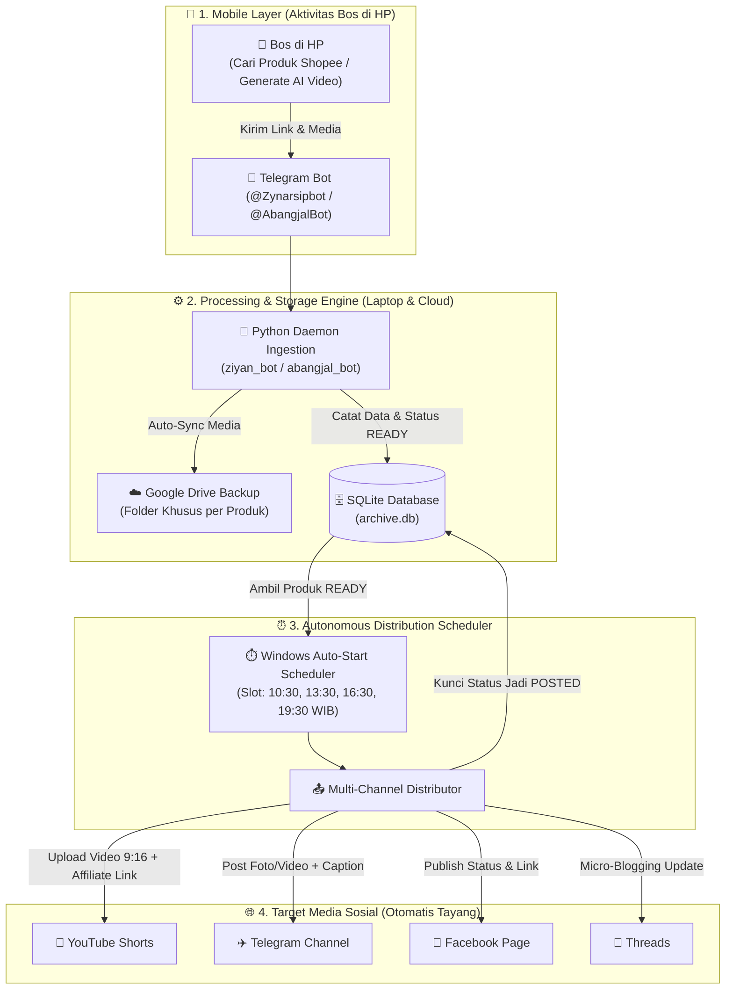

# 📖 MASTER DOKUMENTASI SISTEM BOT ARSIP & DISTRIBUSI KONTEN ZIYANCORP
> **Status Dokumen:** Master Reference & Blueprint Konten  
> **Versi Sistem:** v2.4 (Production Ready)  
> **Target Pengguna:** Tim Internal ZiyanCorp, Agent Konten, & Arsip Bisnis  

---

## 🏛️ 1. RINGKASAN EKSEKUTIF & ARSITEKTUR SISTEM

Sistem Bot Arsip ZiyanCorp adalah **Infrastruktur Pabrik Konten & Afiliasi Otomatis (Autonomous Social Media Distribution Pipeline)** yang menghubungkan aktivitas mobile (HP) pemilik bisnis dengan ekosistem otomatisasi di laptop dan komputasi awan (*cloud*).

Tujuan utamanya adalah: **Menghilangkan 95% pekerjaan manual konten kreator & affiliate marketer** (seperti mengunduh video, memotong, merapikan deskripsi, membuat link affiliate, dan mengunggah manual ke berbagai sosial media setiap hari).

---

## 🌟 2. KELEBIHAN UTAMA SISTEM (THE STRENGTHS)

1. **Zero-Friction bagi Pemilik Bisnis (100% Mobile Friendly):**
   * Bos tidak perlu membuka laptop, membuka browser, atau login ke berbagai akun sosmed.
   * Cukup kirim link produk Shopee dan video AI dari aplikasi Telegram di HP saat sedang santai.
2. **Sistem Pengelompokan Cerdas (*Smart Batch Window*):**
   * Bot memiliki jeda toleransi 60 detik saat menerima file. Jika pengguna mengirimkan 3 foto dan 2 video berturut-turut, bot menggabungkannya ke dalam **1 ID Produk yang sama** dan **1 Folder Google Drive terpadu**.
3. **Mekanisme Anti-Duplikasi (*Idempotency & Status Locking*):**
   * Database SQLite mengunci status setiap item dari `READY` ➡️ `PROCESSING` ➡️ `POSTED`.
   * Konten yang sudah pernah tayang **mustahil terposting dua kali**, mencegah spam dan menjaga reputasi akun.
4. **Token Google Permanen (Production Architecture):**
   * Menggunakan OAuth 2.0 yang telah dialihkan ke mode *In Production* di Google Cloud, sehingga token otentikasi tidak akan pernah mati/expired setiap 7 hari lagi.
5. **Silent Background Daemon (Hemat Daya & RAM):**
   * Berjalan menggunakan `pythonw.exe` di latar belakang Windows tanpa menampilkan jendela konsol CMD hitam yang mengganggu.
6. **Cadangan Ganda (Dual Redundancy):**
   * Semua file media dan metadata tersimpan aman di dua tempat: harddisk lokal laptop (`C:\Users\arija\ziyancorp`) dan cloud Google Drive.

---

## ⚠️ 3. KEKURANGAN & TANTANGAN YANG PERLU DIKETAHUI (THE LIMITATIONS)

1. **Ketergantungan pada Jam Aktif Laptop (Local Host Dependency):**
   * Karena sistem ini di-host secara lokal di laptop (Dell Inspiron 7380), sistem upload otomatis hanya berjalan ketika laptop menyala.
   * *Solusi Jangka Panjang:* Memindahkan sistem ke VPS Cloud (Linux Ubuntu Server / Railway) agar bisa berjalan 24 jam nonstop tanpa perlu menyalakan laptop.
2. **Batas Kuota API Platform (Rate Limits):**
   * YouTube Data API v3 memiliki batas kuota harian default (10.000 unit per hari, atau setara ~6 video upload per hari per akun).
   * *Solusi yang Diterapkan:* Membatasi jadwal ke **4 slot emas harian (10:30, 13:30, 16:30, 19:30 WIB)** untuk menjaga kepatuhan kuota.
3. **Ketergantungan Format URL Shopee:**
   * Bot mengekstrak tautan pendek Shopee (`https://s.shopee.co.id/...`). Jika struktur tautan berubah drastis dari pihak Shopee, regex parser bot memerlukan sedikit penyesuaian.

---

## 🛤️ 4. CATATAN PERJALANAN PENGEMBANGAN (THE EVOLUTION JOURNEY)

### 📍 Fase 1: Eksperimen & Validasi Manual
* **Kondisi Awal:** Mengelola akun kreator Celine Aurel dan Arijal Meutuwah secara manual sangat menyita waktu (generate video AI, download ke HP, edit caption, buka YouTube Studio, upload satu per satu).
* **Keputusan:** Membangun sistem bot arsip berbasis Telegram yang bertindak sebagai jembatan *input-to-database*.

### 📍 Fase 2: Kendala Teknis & Troubleshooting Nyata
* **Masalah Token Expired 7 Hari:** Ditemukan bahwa token Google OAuth mati setiap minggu karena aplikasi Google Cloud masih berada dalam status *Testing*.
* **Solusinya:** Mengubah status Google Auth Platform ke **"In Production"** dan menyempurnakan alur tukar kode otorisasi via HP sehingga token aktif permanen selamanya.
* **Optimasi Penyimpanan Laptop:** Melakukan audit kapasitas SSD laptop, menyelamatkan 50+ custom skill berharga ZiyanCorp, dan membebaskan **38.7 GB** ruang harddisk dari sampah lama.

### 📍 Fase 3: Peluncuran Dual-Persona (Celine & Arijal)
* **Celine Aurel:** Bot terhubung ke Omnichannel (YouTube Shorts, Telegram Channel, Facebook Page, Threads) untuk target market fashion/lifestyle.
* **Arijal Meutuwah:** Bot terhubung khusus untuk YouTube Shorts konten edukasi/pria.
* **Auto-Start Windows:** Memasang skrip VBScript di startup Windows agar sistem otomatis aktif setiap kali laptop dinyalakan.

---

## 🎬 5. MATERI & ANGLE UNTUK KONTEN VIRAL (CONTENT AGENT BLUEPRINT)

Bagian ini dirancang khusus agar tim/agent konten bisa langsung mengubah perjalanan teknis ini menjadi **Konten Edukasi / Storytelling Bernilai Tinggi** untuk menarik audiens affiliate dan pembeli produk digital:

---

### 📌 IDE KONTEN 1: "Cara Saya Bikin Sistem Autopilot Konten dari HP" (Format: Reels/TikTok/Shorts)
* **Hook (0-3 detik):** *"Jangan ngonten kayak buruh! Ini cara saya upload 4 video affiliate sehari ke YouTube, FB, dan Telegram cuma bermodal chat bot."*
* **Problem (3-15 detik):** *"Banyak orang gagal konsisten di Shopee Affiliate karena capek ngedit dan upload manual berkali-kali setiap hari."*
* **The Solution (15-45 detik):** 
  1. Buat video produk pakai AI (Faceless / tanpa wajah).
  2. Buka Telegram di HP ➡️ Kirim link Shopee + video ke Bot buatan sendiri.
  3. Robot di laptop otomatis mengarsipkan, mem-backup ke Google Drive, dan mengunggahnya tepat jam 10:30, 13:30, 16:30, dan 19:30 WIB.
* **Call to Action (45-60 detik):** *"Mau tahu formula prompt AI yang saya pakai buat bikin videonya tanpa tampil muka? Cek link di bio, sudah saya rangkum lengkap di E-Book Faceless Creator!"*

---

### 📌 IDE KONTEN 2: "Studi Kasus: Membangun Pabrik Konten Tanpa Wajah" (Format: Carousel IG / LinkedIn / Thread)
* **Slide 1:** Judul: *Arsitektur Pabrik Konten Otomatis: Dari Ide Sampai Cuan Tanpa Buka Laptop.*
* **Slide 2:** *Diagram Alur: HP (Telegram) ➡️ Database SQLite ➡️ Google Drive ➡️ Multi-Platform Upload.*
* **Slide 3:** *Pelajaran Mahal: Mengapa Token Google Sering Mati Tiap 7 Hari & Cara Mengatasinya (Ubah Testing ke Production).*
* **Slide 4:** *Kelebihan Sistem: Anti-Double Post, Auto-Backup Cloud, Zero Distraction.*
* **Slide 5:** *Kelemahan & Rencana Masa Depan: Migrasi dari Laptop Rumah ke Cloud VPS.*
* **Slide 6 (CTA):** *Panduan lengkap prompt dan setup monetisasinya tersedia di bio.*

---

### 📌 IDE KONTEN 3: "Behind The Scene (BTS) Seorang Tech-Savvy Affiliate"
* **Konsep Visual:** Rekaman layar HP saat mengirim pesan ke Telegram bot, lalu menampilkan robot di laptop langsung merespon dan file masuk ke Google Drive secara instan.
* **Pesan Utama:** Menunjukkan transparansi bahwa membangun sistem automasi itu nyata, praktis, dan bisa dilakukan oleh siapa saja yang mau belajar memanfaatkan teknologi AI dan bot modern.

---

*(Dokumentasi ini telah diverifikasi dan disimpan secara permanen di repositori ZiyanCorp).*
